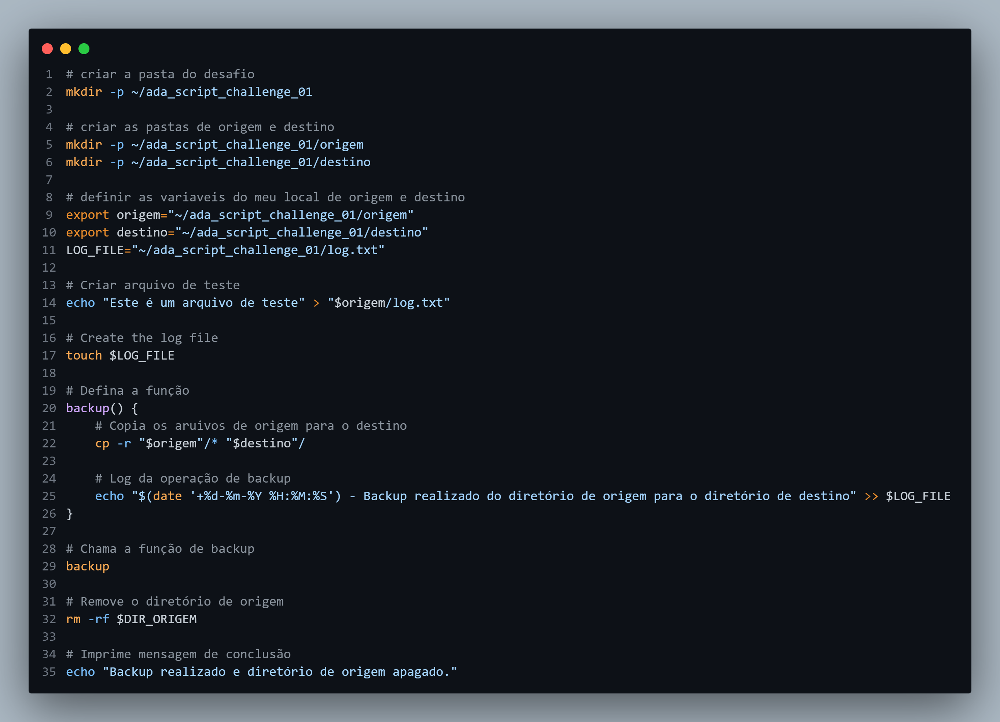
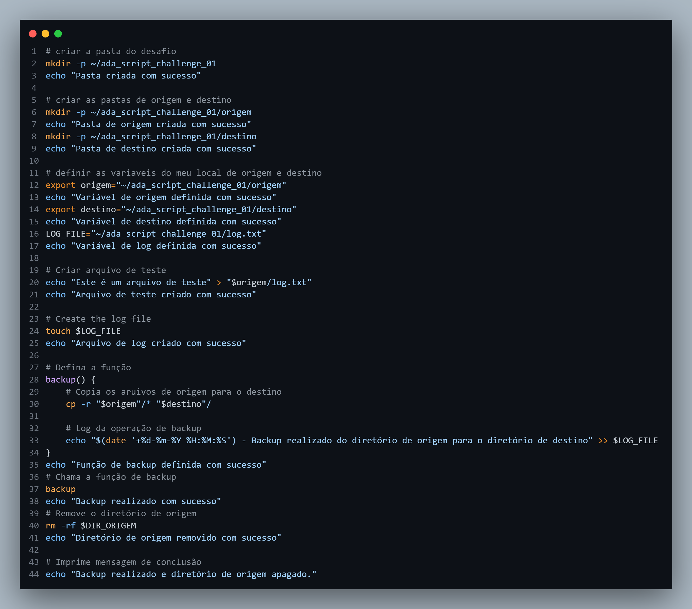

# Adatech Lets Code Santander 2024 - DevOps Challenge

### Create 2 folders, a source directory and a destination directory and create a file in the source directory, include 2 environment variables, 1 with the path of the source directory and one for the destination directory, now create a new file to insert log , each time you have a copy action from the source folder to the destination folder, insert a new log in the document, make a backup from the source folder to the destination folder, then delete the source folder.

### Criar 2 pastas, uma diretório de origem e uma diretório de destino e crie um arquivo no diretorio de origem, inclua 2 variaveis de ambiente 1 com o caminho da diretório de origem e uma para diretório de destino,  crie agora  um novo arquivo para inserir log, a cada vez que tiver uma acao de copia da pasta de origem para pasta de destino insira um novo log no documento, faça backup da pasta de origem para de destino, depois apague a pasta de origem.

### Using script now, Create 2 folders, a source directory and a destination directory and create 3 files in the source directory, include 2 environment variables 1 with the path of the source directory and one for the destination directory, now create a new one file to insert log, each time there is a copy action from the source folder to the destination folder, insert a new log into the document, then create a backup file that is COMPRESSED of the documents created in the source folder and only perform the backup of this file in the destination folder.

### Utilizando script agora, Criar 2 pastas, uma diretório de origem e uma diretório de destino e crie 3 arquivos no diretorio de origem, inclua 2 variaveis de ambiente 1 com o caminho da diretório de origem e uma para diretório de destino,  crie agora  um novo arquivo para inserir log, a cada vez que tiver uma acao de copia da pasta de origem para pasta de destino insira um novo log no documento, depois crie um arquivo de backup que COMPACTADO dos documentos criados na pasta de origem e so realize o backup desse arquivo na pasta de destino.

# Basic scripting

# Basic scripiting add echo

